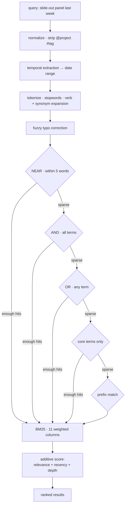
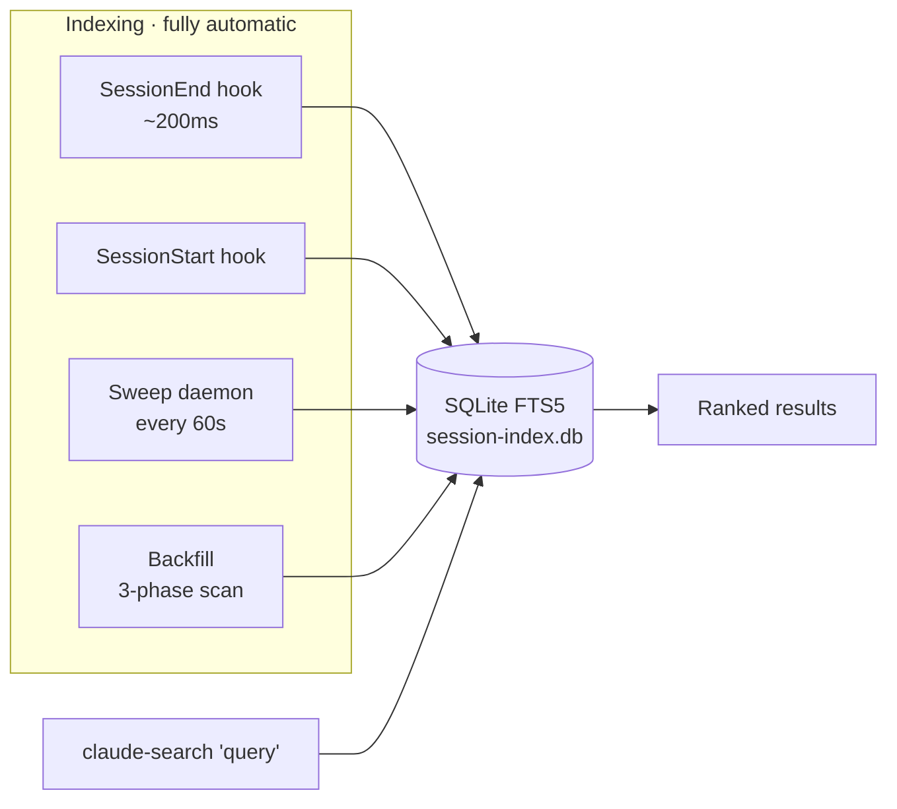

<div align="center">

# claude-session-search

**Find any past Claude Code session in milliseconds — full-text search across every project, ranked like a search engine.**

[](LICENSE)
[](#measure-and-tune-your-own-search)

[Why it exists](#why-this-exists) · [Install](#install-in-one-command) · [Search](#search-by-keyword-date-project-or-tag) · [Resume](#resume-the-right-session-with-one-keystroke) · [Ranking](#see-exactly-why-every-result-ranked-where-it-did) · [Architecture](#the-index-maintains-itself)

</div>

```console
$ claude-search "rum latency"

  ╭──────────────────────────────────────────────────────────────────────╮
  │ Session Search                                       3 results · 2ms │
  ╰──────────────────────────────────────────────────────────────────────╯
   1  RUM Analysis: Friday Event Latency Report
       5mo ·   10 msgs · audit, docs, events, monitoring, +1    c1d32436
  ──────────────────────────────────────────────────────────────────────
   2  CloudWatch dashboards + p95 alarm thresholds
       2mo ·    8 msgs · docs, events, monitoring               e3d88717
  ──────────────────────────────────────────────────────────────────────
   3  Fly.io RUM latency testing, cold start bias, CLI fixes,
      cross-provider region discovery
       5mo ·   20 msgs · bugfix, deployment, monitoring, +2     08ada21a
  ╭──────────────────────────────────────────────────────────────────────╮
  │ ●  claude-search --resume N  ·  --fzf for interactive                │
  ╰──────────────────────────────────────────────────────────────────────╯
```

> Notice `rum` matched sessions about *monitoring* and *CloudWatch* — the query expanded through a synonym table before it ever hit the index. [See how](#see-exactly-why-every-result-ranked-where-it-did)

---

## Why this exists

Claude Code records every session with rich metadata — AI-written summaries, message counts, git branches, timestamps. **None of it is searchable.** When you need "that migration session from last week," your only tool is scrolling.

| The problem today | The cost |
|---|---|
| `/resume` shows a flat, unsearchable list | Finding one session means scrolling past hundreds |
| Sessions are siloed per project directory | No cross-project discovery — 220 projects, 220 manual checks |
| Summaries, branches, and tags live in unindexed JSON | No keyword search, no date filtering, no fuzzy matching |

**This tool indexes every session into a single SQLite FTS5 database and queries it through a ranked search pipeline** — so retrieval takes ~2&nbsp;ms instead of minutes of scrolling.

### What you can do

| You want to… | Run |
|---|---|
| Find sessions by keyword | `claude-search "bottle menu"` |
| Search by time, in plain English | `claude-search "monitoring last week"` |
| Scope to one project | `claude-search "@reso sync"` |
| Filter by topic tag | `claude-search "#auth login"` |
| Browse + resume interactively | `claude-search --fzf "migration"` |
| Resume a result by number | `claude-search --resume 2` |
| Understand *why* a result ranked | `claude-search "rum latency" --explain` |
| Search inside the conversation | `claude-search "cold start" --deep-search` |
| Check index health | `claude-search --stats` |
| Tune your own search quality | `claude-search --analytics` |

---

## Install in one command

```bash
git clone https://github.com/renchris/claude-session-search.git
cd claude-session-search
./install.sh
```

<details>
<summary><b>What the installer does</b> (idempotent — safe to re-run)</summary>

<br>

1. **Symlinks** hooks and `bin/` into `~/.claude/` (edits in the repo go live immediately)
2. **Registers** `SessionEnd` + `SessionStart` hooks in `settings.json` (backs it up first)
3. **Backfills** every existing session via a 3-phase scan
4. **Tags** sessions with regex and builds the FTS5 index
5. **Adds** `~/.claude/bin` to your `PATH`
6. **Schedules** two background jobs (macOS `launchd`): a weekly backfill and a 60-second sweep
7. **Pre-compiles** the Python engine for faster cold starts

</details>

**Requires** `sqlite3` (with FTS5 — the macOS default), `python3` ≥ 3.8, and `jq`.
**Optional** (each unlocks a feature, none are required):

| Package | Unlocks |
|---|---|
| `fzf` | Interactive picker (`--fzf`) |
| `rapidfuzz` | Typo-tolerant fuzzy correction |
| `anthropic` | Haiku tagging + LLM query expansion |
| `yake` | Multi-word key-phrase extraction |

**Update:** `git pull && ./install.sh`  ·  **Uninstall:** `./uninstall.sh` (preserves your database)

---

## Search by keyword, date, @project, or #tag

```bash
claude-search "bottle menu"                 # Keyword search
claude-search "monitoring last week"        # Temporal: "yesterday", "march 1", "last 3 days"
claude-search "@reso sync"                  # Inline project filter
claude-search "#auth #bugfix login"         # Inline tag filters (combinable)
claude-search --after 2026-03-01 "rum"      # Explicit date range
claude-search --project reso "sync"         # Flag-style project filter
claude-search --deep-search "cold start"    # Also search inside conversation turns
claude-search --json "floor plan"           # JSON output for scripting
```

**Natural-language dates work out of the box.** `yesterday`, `today`, `this week`, `last week`, `last 3 days`, `last 2 months`, `march 1`, and ISO dates (`2026-03-01`) are extracted from the query and turned into a date filter automatically.

**Abbreviations expand before the search runs.** `rum` → `monitoring, cloudwatch, metrics, observability`; `db` → `database, turso, sqlite`; `ws` → `websocket, soketi, pusher`. The dictionary ships with **66 terms across 289 expansions** and is editable in [`synonyms/default.json`](synonyms/default.json).

---

## Resume the right session with one keystroke

```bash
claude-search --fzf "migration"
```

<p align="center">
  
</p>

Pipes ranked results into an [`fzf`](https://github.com/junegunn/fzf) picker with a live preview pane that re-searches as you type:

| Key | Action |
|---|---|
| <kbd>Enter</kbd> | Resume the session (`claude --resume <id>`) |
| <kbd>Ctrl-Y</kbd> | Copy the session ID to the clipboard |
| <kbd>Ctrl-O</kbd> | Open the project directory |
| *type* | Live re-search as you type |

Prefer the keyboard from a plain search? `claude-search --resume 2` resumes the 2nd result of your last search — no need to retype the query.

---

## See exactly why every result ranked where it did

Search is a black box in most tools. Here it isn't — `--explain` shows the matched columns, the strategy that fired, the BM25 score, and every synonym the query expanded into:

```console
$ claude-search "rum latency" --explain

   1  RUM Analysis: Friday Event Latency Report
       5mo ·   10 msgs · audit, docs, events, monitoring, +1    c1d32436
      ┊ 'rum' → summary, first_prompt, keywords
      ┊ 'latency' → summary, first_prompt, keywords
      ┊ 'monitoring' → first_prompt, tags, keywords
      ┊ Strategy: NEAR proximity · BM25: 14.77
      ┊ Expanded: cloudwatch, metrics, monitoring, observability, real user monitoring
```

<details>
<summary><b>The ranking model</b> — BM25 relevance, recency, and conversation depth</summary>

<br>

Every result gets an **additive score** so no single signal can dominate:

```
score = 0.60 · BM25      (text relevance, normalized across the result set)
      + 0.15 · recency   (Gaussian decay, 30-day half-life — a gentle tiebreaker)
      + 0.10 · depth     (message-count sweet spot: 10–100 msgs rank highest)
      + 0.15 · BM25 × recency   (interaction: reward results that are both)
```

BM25 itself is **column-weighted across 11 indexed fields** — a hit in the AI-written summary counts far more than a hit in a shell command:

| Column | Weight | Why |
|---|--:|---|
| `summary` | 12.0 | Claude-generated description — the strongest signal |
| `search_aliases` | 8.0 | LLM-generated alternate phrasings of the session |
| `tags` | 5.0 | Semantic categories (`auth`, `monitoring`, …) |
| `files_changed` | 3.5 | File paths touched during the session |
| `first_prompt` | 3.0 | Your opening message |
| `keywords` | 3.0 | Auto-extracted technical terms |
| `context_text` | 2.5 | Your first few messages from the transcript |
| `assistant_text` | 1.5 | Claude's responses |
| `commands_run` | 1.0 | Shell commands executed |
| `project_name` | 0.5 | Broad project match |

</details>

<details>
<summary><b>The query pipeline</b> — 5 fallback strategies, widening only when results are sparse</summary>

<br>



The pipeline tries the **most precise** strategy first and only widens when a strategy returns fewer than 3 hits — so exact phrase matches win, but a fuzzy or partial query still finds something. Two safety nets sit underneath:

- **LLM fallback** — if fewer than 3 results come back, Haiku rewrites the query into 4 interpretations, each searched and merged via Reciprocal Rank Fusion *(needs `ANTHROPIC_API_KEY`)*.
- **Deep search** (`--deep-search`) — also queries a turn-level chunk index (5-turn sliding windows), so a phrase buried mid-conversation is findable even when the summary never mentions it.

</details>

---

## The index maintains itself

You never run an indexer by hand. Hooks capture sessions as they happen; a sweep daemon catches anything the hooks miss; a backfill seeds history and self-heals weekly.



<details>
<summary><b>Where the data comes from</b> — six sources, highest quality wins</summary>

<br>

When two sources describe the same session, the richer one overwrites the thinner one:

| Source | Provides | Role |
|---|---|---|
| `sessions-index.json` | AI summaries, message counts, branches, timestamps | **Richest** — wins on conflict |
| `SessionEnd` hook | The just-finished session + enriched transcript data | Live capture (`< 200 ms`) |
| `SessionStart` hook | The session you're opening now | Live capture |
| 60-second sweep | New/changed transcripts the hooks missed | Self-healing (`< 500 ms` idle) |
| `history.jsonl` | User prompts, project paths | Gap fill |
| Legacy entries | Pre-`sessionId` history grouped by project + time gaps | Synthetic IDs |

</details>

### Tag sessions for topic-based recall

Tags like `database`, `monitoring`, `bottle-service`, `slide-out` are indexed and weighted, so a search for a *topic* surfaces sessions whose summaries never used your exact words.

```bash
# Free, instant — 42 regex patterns (24 technology · 10 task-type · 8 domain)
./scripts/session-index-tag.sh --regex-only

# Higher accuracy via Claude Haiku — ~95% accurate, ~$0.09 for 650 sessions
ANTHROPIC_API_KEY=sk-... ./scripts/session-index-tag.sh
```

---

## Measure and tune your own search

Every search is logged locally, so you can see what's slow and what's failing:

```console
$ claude-search --analytics

  ╭────────────────────────────────────────────────────────╮
  │ Search Analytics                          531 searches │
  ├────────────────────────────────────────────────────────┤
  │ Avg latency                                      4.9ms │
  │ Zero-result                             18.5% (98/531) │
  ╰────────────────────────────────────────────────────────╯

  Top Queries
  ────────────────────────────────────────────────────────
    37×  bottle service menu                 avg 10 results
    14×  slide-out panel                     avg  6 results
     8×  floor plan                          avg  9 results

  Failed Queries  (tuning targets)
  ────────────────────────────────────────────────────────
     3×  xyznonexistent
```

`claude-search --stats` shows the complementary view — total sessions, tagged count, and a breakdown by source. `--analytics --fails` lists only zero-result queries, the exact set worth adding synonyms for.

---

## Every layer degrades gracefully

No optional dependency is load-bearing. Remove any one and search still works — just with one fewer enhancement.

| If this is unavailable | Fallback | What you lose |
|---|---|---|
| Haiku API key | Regex-only tagging | Slightly less precise tags |
| `rapidfuzz` | Skip fuzzy correction | Typo tolerance (synonyms still cover most) |
| `anthropic` SDK | Raw HTTP, or skip LLM expansion | Nothing, or the LLM query fallback |
| `sessions-index.json` | Rebuild from transcripts + `history.jsonl` | Some per-session metadata |
| `fzf` | Plain ranked text output | The interactive picker |
| `yake` | Simpler keyword extraction | Multi-word key phrases |

---

## Customize

**Add domain synonyms** for better recall — edit [`synonyms/default.json`](synonyms/default.json):

```json
{ "term": "k8s", "expansions": ["kubernetes", "cluster", "pod", "deployment"], "category": "infra" }
```

Then reload the table with `./scripts/session-index-backfill.sh`.

<details>
<summary><b>Command reference</b></summary>

<br>

| Flag | Effect |
|---|---|
| `--fzf` | Interactive picker with live re-search |
| `--resume N` | Resume result #N (with a query, or from the last search) |
| `--explain` | Show match attribution, strategy, BM25, and expansions |
| `--deep-search` | Also search within conversation turns |
| `--after` / `--before YYYY-MM-DD` | Explicit date range |
| `--project NAME` | Filter by project |
| `--min-msgs N` | Minimum message count |
| `--limit N` | Max results (default 10) |
| `--json` | JSON output for scripting |
| `--stats` | Index statistics |
| `--analytics` / `--analytics --fails` | Search-log analytics |
| `--preview ID` | Preview a single session |

</details>

<details>
<summary><b>File layout</b> — the repo symlinks into <code>~/.claude/</code></summary>

<br>

All installed files are symlinks, so a `git pull` updates your live install instantly.

```
claude-session-search/                      ~/.claude/
├── hooks/
│   ├── session-index-end.sh        ──────→ hooks/session-index-end.sh     (SessionEnd)
│   ├── session-index-start.sh      ──────→ hooks/session-index-start.sh   (SessionStart)
│   ├── session-index-sweep.sh      ──────→ hooks/session-index-sweep.sh   (60s daemon)
│   └── lib/session-index-helpers.sh ─────→ hooks/lib/…
├── bin/
│   ├── claude-search               ──────→ bin/claude-search             (the CLI)
│   └── session-search.py           ──────→ bin/session-search.py         (the engine)
├── scripts/
│   ├── session-index-backfill.sh           (3-phase history scan)
│   ├── session-index-tag.py                (regex + Haiku tagging)
│   └── session-index-chunk.py              (turn-based chunks for --deep-search)
├── synonyms/default.json                   (66 terms · 289 expansions)
├── config/*.plist                          (launchd: weekly backfill + 60s sweep)
├── install.sh  ·  uninstall.sh
                                            └── session-index.db          (SQLite FTS5)
```

</details>

---

## License

[MIT](LICENSE)
