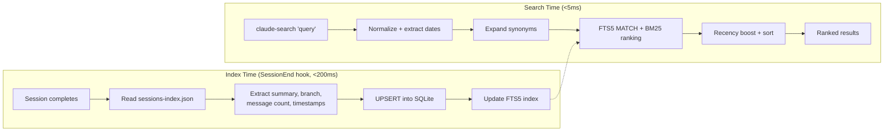
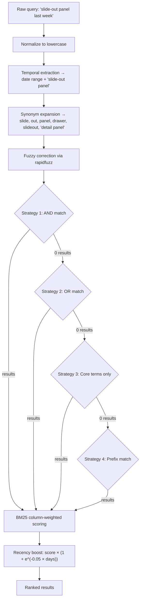

# claude-session-search

Instant full-text search across all Claude Code sessions — finding "that migration session from last week" takes <5ms instead of scrolling through hundreds of entries.

```
$ claude-search "bottle menu"

#   Age        Project                   Branch     Msgs  Summary
─────────────────────────────────────────────────────────────────────────────────
1   2w ago     reso-management-app       main         37  Bottle Service Schema & Menu Implementation
2   3w ago     reso-management-app       main         22  Bottle Menu Preview Route with Vesper 2025 Data
3   1mo ago    reso-management-app       main         12  Master Catalog: 103 Products, 8 Categories

3 result(s) (2ms)
```

## Why this exists

Claude Code stores rich session metadata — AI-generated summaries, message counts, git branches, timestamps — but none of it is searchable. Three specific problems:

| Problem | Impact |
|---------|--------|
| `/resume` shows a flat, unsearchable list | Finding one session means scrolling through hundreds |
| Sessions are siloed per project directory | No cross-project discovery (19 projects = 19 manual checks) |
| Summaries, branches, and tags sit in unindexed JSON | No keyword search, no date filtering, no fuzzy matching |

This tool indexes everything into a single SQLite FTS5 database and exposes it through a ranked search CLI.

## Quick start

```bash
git clone https://github.com/renchris/claude-session-search.git
cd claude-session-search
./install.sh
```

One command handles everything: symlinks hooks and bin into `~/.claude/`, registers SessionEnd/SessionStart hooks in `settings.json`, backfills all existing sessions, tags them, and adds `~/.claude/bin` to your PATH.

**Prerequisites**: `sqlite3` (macOS default, FTS5 required), `python3` 3.8+, `jq`. Optional: `fzf` (interactive mode), `rapidfuzz` (fuzzy correction).

**Update**: `git pull && ./install.sh` | **Uninstall**: `./uninstall.sh`

## Search finds sessions by keyword, date, or abbreviation in <5ms

```bash
claude-search "bottle menu"                # Keyword search
claude-search "monitoring last week"       # Temporal query ("yesterday", "march 1", "last 3 days")
claude-search --fzf "migration"            # Interactive fzf picker with live re-search
claude-search --after 2026-03-01 "rum"     # Explicit date filter
claude-search --project reso "sync"        # Scope to one project
claude-search --json "floor plan"          # JSON output for scripting
claude-search --stats                      # Index statistics
```

Abbreviations expand automatically: `db` → database/turso/sqlite, `ws` → websocket/soketi/pusher, `rum` → monitoring/cloudwatch/metrics. 45 domain terms with 192 expansions, editable in `synonyms/default.json`.

### fzf interactive mode resumes sessions with one keystroke

```bash
claude-search --fzf "migration"
```

| Key | Action |
|-----|--------|
| **Enter** | Resume selected session (`claude --resume <id>`) |
| **Ctrl-Y** | Copy session ID to clipboard |
| **Ctrl-O** | Open project directory |
| Type | Live re-search as you type |

## Architecture: hooks index automatically, search reads the index



### Three data sources feed the index, prioritized by quality

| Phase | Source | What it provides | Priority |
|-------|--------|-----------------|----------|
| 1 | `sessions-index.json` | AI summaries, message counts, branches, timestamps | Highest — overwrites lower sources |
| 2 | `history.jsonl` | User prompts, project paths | Gap fill — skips sessions from Phase 1 |
| 3 | Legacy entries (no session ID) | Grouped by project + 5-minute gaps | Synthetic IDs for pre-sessionId history |

### Search pipeline uses BM25 ranking with progressive relaxation



**BM25 column weights** prioritize summaries and tags over raw prompts:

| Column | Weight | Rationale |
|--------|--------|-----------|
| summary | 10× | Claude-generated, highest signal |
| tags | 8× | Semantic categories |
| keywords | 3× | Extracted technical terms |
| first_prompt | 2× | User's opening message |
| project_name | 1× | Broad project match |

### Semantic tagging enriches search with topic classification

```bash
# Regex patterns (free, covers 14 tech + 12 task + 8 domain patterns)
./scripts/session-index-tag.sh --regex-only

# Claude Haiku API (~$0.09 for 650 sessions, ~95% accuracy)
ANTHROPIC_API_KEY=sk-... ./scripts/session-index-tag.sh
```

Tags like `database`, `monitoring`, `bottle-service`, `slide-out` are stored in the sessions table and indexed by FTS5, boosting recall for topic-based searches.

## File layout: repo symlinks into ~/.claude/

```
claude-session-search/              ~/.claude/
├── hooks/                          ├── hooks/
│   ├── session-index-end.sh   ──→  │   ├── session-index-end.sh
│   ├── session-index-start.sh ──→  │   ├── session-index-start.sh
│   └── lib/                        │   └── lib/
│       └── session-index-      ──→ │       └── session-index-
│           helpers.sh              │           helpers.sh
├── bin/                            ├── bin/
│   ├── claude-search          ──→  │   ├── claude-search
│   └── session-search.py      ──→  │   └── session-search.py
├── scripts/                        └── session-index.db (SQLite FTS5)
│   ├── session-index-backfill.sh
│   └── session-index-tag.sh
├── synonyms/default.json
├── install.sh
└── uninstall.sh
```

All installed files are symlinks. Update with `git pull && ./install.sh`. Uninstall with `./uninstall.sh` (preserves database).

## Customization: add domain-specific synonyms for better recall

Edit `synonyms/default.json`:

```json
{"term": "k8s", "expansions": ["kubernetes", "cluster", "pod", "deployment"], "category": "infra"}
```

Re-run `./scripts/session-index-backfill.sh` to reload the synonym table.

## Graceful degradation: every component fails safely

| Component unavailable | Fallback | Search still works? |
|----------------------|----------|-------------------|
| Haiku API | Regex-only tagging | Yes — tags less precise |
| `rapidfuzz` not installed | Skip fuzzy correction | Yes — synonyms cover ~80% |
| `sessions-index.json` missing | Extract from history.jsonl | Yes — less metadata |
| `fzf` not installed | Plain text ranked results | Yes — no interactive picker |

## License

MIT
